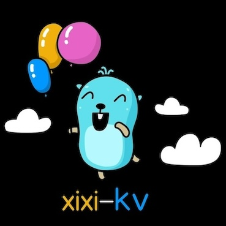

\
   [](https://pkg.go.dev/github.com/XiXi-2024/xixi-kv)            [](https://goreportcard.com/report/github.com/XiXi-2024/xixi-kv)

xixi-kv 是基于bitcask 模型的、并发安全的 kv 存储引擎，具备读写低时延、高吞吐、超越内存容量的数据存储能力等特性。
### 特性

更多特性和使用请参考：[issues](https://github.com/XiXi-2024/xixi-kv/issues)

* 支持并发安全的分片索引实现，并提供多种底层索引配置选项，包括 B 树、跳表、map 等
* 支持高性能的、无最大操作数限制的批处理功能，并能保证原子性、持久性、一致性
* 支持标准文件 I/O 和内存文件映射（MMap）两种 I/O 实现和相应的配置选项，适用于不同数据文件容量场景
* 支持数据库层级的迭代器功能，对外提供迭代器配置选项，允许用户灵活控制数据的遍历方式

### 快速入门
完整示例详见：[main.go](examples/db/main.go)

#### 安装
安装`Go`并运行`go get`命令
```shell
go get -u github.com/XiXi-2024/xixi-kv
```
#### 打开数据库
xixi-kv 的核心对象是`DB`，提供默认配置项`DefaultOptions`，如果需要打开或创建数据库请使用`Open`方法
```go
package main

import kv "github.com/XiXi-2024/xixi-kv"

func main() {
	db, err := kv.Open(kv.DefaultOptions)
    // ...
}

```
#### 基础操作
```go
// 新增
err = db.Put(key, logRecord)

// 获取
val, err := db.Get(key)

// 删除
err = db.Delete(key)
```
### 高级配置

xixi-kv 提供多种配置选项，可根据实际需求进行调整

```go
opts := kv.Options{
    DirPath:            "/path/to/data",    // 数据目录
    DataFileSize:       256 * 1024 * 1024,  // 数据文件大小限制
    SyncStrategy:       kv.Threshold,       // 同步策略
    BytesPerSync:       8 * 1024 * 1024,    // 每写入多少字节执行一次同步
    IndexType:          kv.BPTree,          // 索引类型
    ShardNum:           16,                 // 索引分片数
    FileIOType:         kv.MemoryMap,       // I/O 类型
    DataFileMergeRatio: 0.5,                // 合并触发比例
    EnableBackgroundMerge: true,            // 启用后台合并
}
```

### 基准测试

完整测试详见：[db_test.go](benchmark/db_test.go)

#### 环境

```go
goos: darwin
goarch: arm64
cpu: Apple M1
```

#### os.File

| 接口   | QPS（单线程） | QPS（多线程） |
| ------ | ------------- | ------------- |
| Put    | 444279        | 376621        |
| Get    | 1002304       | 2370576       |
| Delete | 1297602       | 1006764       |

#### mmap

| 接口   | QPS（单线程） | QPS（多线程） |
| ------ | ------------- | ------------- |
| Put    | 1004450       | 1000326       |
| Get    | 2210830       | 8933606       |
| Delete | 6813520       | 4509661       |

### 注意事项

在 Windows 系统中运行时，需要确保所有打开的 DB 实例或文件显式关闭才能删除文件，否则可能会出现以下错误

```plaintext
The process cannot access the file because it is being used by another process.
```

建议在 macOS 或 Linux 环境下运行，或在 Windows 系统下测试时手动删除生成的文件。

### 贡献

随着项目规模越来越大，我深感个人力量是有限的，项目仍有许多问题需要解决，许多有挑战的功能需要实现，如果你对该项目感兴趣，非常欢迎提交 issue 和 pr，我会第一时间响应！